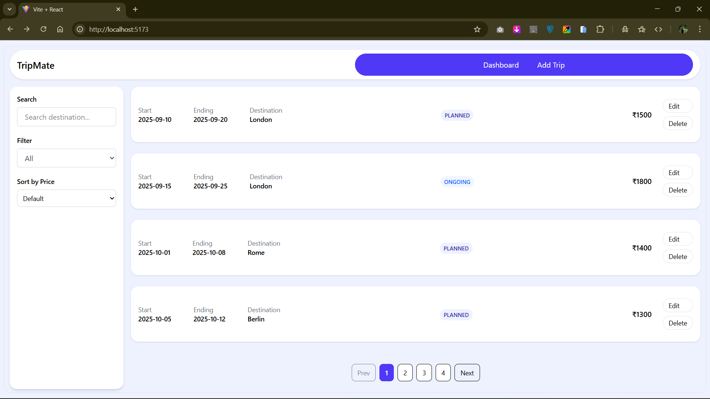
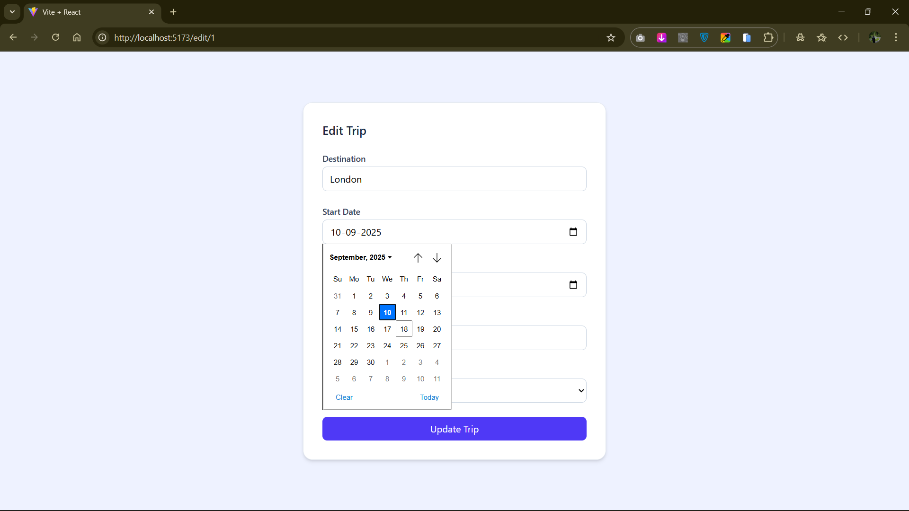
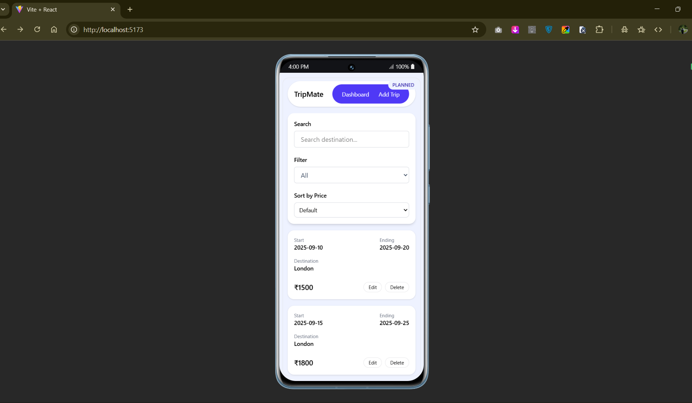
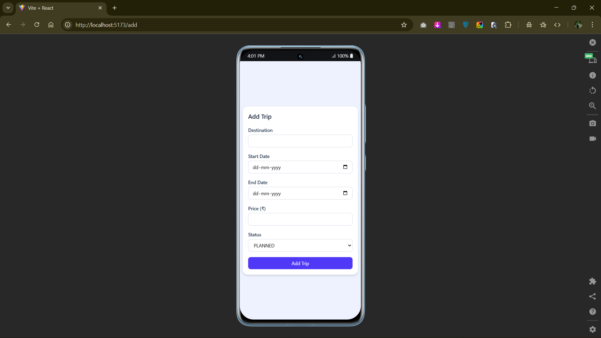

# Trip Management App

A React.js Single Page Application (SPA) for managing trips with CRUD operations, search, filtering, sorting, pagination, and responsive design.

---

## How to Run the Project

1. **Clone the repository**

    ```bash
    git clone https://github.com/Rajugit07/Raju-Pradhani-React-Trip-Management-SEP-2025.git
    cd trip

    ```

2. Install dependencies
   npm install

3. Start the development server
   npm run dev

4. Open in browser
   http://localhost:5173

## Features Implemented

    - CRUD Operations
        - Add new trips
        - Edit existing trips
        - Delete trips
    - Trip Listing
        - Display trips in card format
        - Paginated view for better readability
    - Search & Filter
        - Search by destination
        - Filter by status: PLANNED, ONGOING, COMPLETED
    - Sorting
        - Sort trips by price
    - Form Validation
        - Add/Edit trip forms with validation (custom)
    - Responsive Design
        - Mobile-friendly UI using Tailwind CSS
    - Routing
        - / -> Dashboard (trip list + search + filter + pagination)
        - /add -> Add trip form
        - /edit/:id -> Edit trip form

## Screenshots of UI






## Tech Stack
    - React 18+
    - React Router v6
    - Tailwind CSS
    - Vite (build tool)
